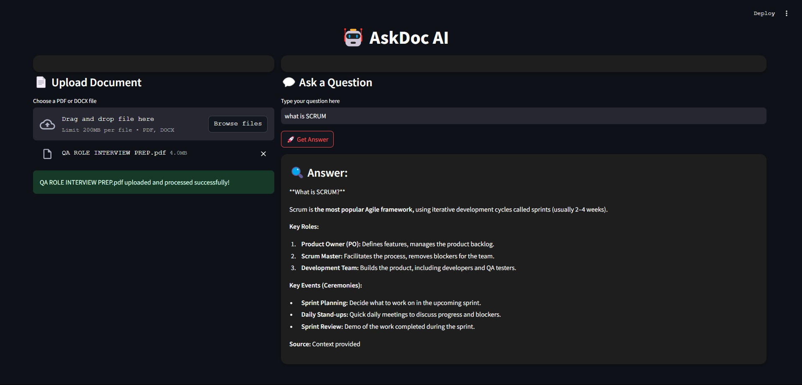

# 🤖 AskDoc AI - RAG Application

AskDoc AI is an intelligent document-based Question Answering (QA) application powered by **Retrieval-Augmented Generation (RAG)**. It allows users to upload PDF/DOCX files, extract content, and query the documents using advanced NLP techniques. The system retrieves the most relevant chunks of text and generates precise, context-aware answers.

## 🚀 Features
- 📄 **Document Upload:** Supports PDF and DOCX files.
- 🔍 **RAG-based QA System:** Combines retrieval with generative AI for accurate answers.
- ⚡ **Chroma DB Integration:** Efficient vector storage and retrieval for quick responses.
- 🤖 **Generative AI:** Utilizes the Gemini API to generate detailed, context-rich answers.
- 🌗 **Dynamic Theme Toggle:** Switch between light and dark modes for a better UI experience.
- 💼 **Modern UI:** Stylish, card-based layout with subtle animations and responsive design.

---
## Working Demo of My Webapp

Here is a working demo of my webapp:



---

## 📂 Directory Structure
```
aritro1011-askdocrag/
├── app.py                # Streamlit app interface
├── generator.py          # Answer generation using Gemini API
├── retriever.py          # Text retrieval using Chroma DB and Sentence Transformers
└── utils.py              # PDF and DOCX text extraction utilities
```

---

## ⚙️ Setup Instructions

### 1️⃣ **Clone the Repository**
```bash
git clone https://github.com/yourusername/aritro1011-askdocrag.git
cd aritro1011-askdocrag
```

### 2️⃣ **Create a Virtual Environment (Optional but Recommended)**
```bash
python -m venv venv
source venv/bin/activate  # On Windows: venv\Scripts\activate
```

### 3️⃣ **Install Dependencies**
```bash
pip install -r requirements.txt
```

### 4️⃣ **Set Up Gemini API Key**
- **Note:** The API key is not included for security reasons.
- Get your API key from [Google Cloud Console](https://console.cloud.google.com/).
- Create a `.env` file in the root directory:
  ```bash
  touch .env
  ```
- Add your API key:
  ```env
  GEMINI_API_KEY=your_api_key_here
  ```
- Update `generator.py` to load the API key from the environment:
  ```python
  from dotenv import load_dotenv
  load_dotenv()
  import os
  GEMINI_API_KEY = os.getenv("GEMINI_API_KEY")
  ```

### 5️⃣ **Run the Application**
```bash
streamlit run app.py
```

The app will open in your default browser.

---

## 📄 How It Works
1. **Upload Document:** Upload a PDF or DOCX file.
2. **Text Extraction:** Extracts text using `pdfplumber` (PDF) or `python-docx` (DOCX).
3. **Embedding:** Chunks of text are embedded using `SentenceTransformer`.
4. **Storage:** Embedded vectors are stored in Chroma DB.
5. **Querying:** User queries are processed to find the most relevant text chunks.
6. **Answer Generation:** The retrieved context is sent to the Gemini API for generating a comprehensive answer.

---

## 📦 Dependencies
- **Streamlit** - For building the web interface
- **Sentence Transformers** - For creating semantic embeddings
- **Chroma DB** - Vector database for fast retrieval
- **Google Generative AI (Gemini API)** - For generating answers
- **pdfplumber** - Extracting text from PDFs
- **python-docx** - Extracting text from DOCX files

---

## 🚀 Future Improvements
- Add support for more document formats (e.g., TXT, PPTX)
- Improve UI with more animations and customization options
- Implement advanced search filters
- Add multilingual support

---

## 🤝 Contributing
Contributions are welcome! Feel free to open issues or submit pull requests.

---


## 🙏 Acknowledgments
- **Google Gemini API** for advanced content generation
- **Chroma DB** for efficient vector storage and retrieval
- **Hugging Face** for providing powerful sentence transformers

---

### 🔑 **Note:**
Make sure to set your own API key in the `.env` file. The app won’t work without it!

